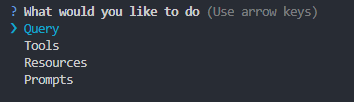

# MCP Server

<p align="center">
  
</p>

This project is based on the Web Dev Simplified tutorial: [The Ultimate MCP Crash Course - Build From Scratch](https://www.youtube.com/watch?v=ZoZxQwp1PiM&t=92s).

MCP Server is a Node.js/TypeScript project implementing a server compatible with the Model Context Protocol (MCP), designed for AI and automation applications. The project includes both the server logic and a sample client CLI.

## Main Features

- **MCP Server**: Implements the MCP protocol for handling AI requests.
- **Sample Client CLI**: A command-line interface to test and interact with the server, built using `@inquirer/prompts` for interactive prompts and input.
- **Gemini API Support**: Integration with Google Gemini via `@ai-sdk/google`.
- **Data Validation**: Uses Zod for input validation.
- **Configuration Management**: Supports environment variables via `dotenv`.

## Project Structure

```
├── src/
│   ├── server.ts        # MCP server entry point
│   ├── client.ts        # Sample client
│   └── data/
│       └── users.json   # Sample user data
├── build/               # TypeScript build output
├── package.json         # Dependencies and scripts
├── tsconfig.json        # TypeScript configuration
├── .env.example         # Example environment configuration
```

## Prerequisites

- Node.js >= 18
- npm >= 9

## Installation

1. Clone the repository:
   ```sh
   git clone <repo-url>
   cd mcp-server
   ```
2. Install dependencies:
   ```sh
   npm install
   ```
3. Configure environment variables:
   - Copy `.env.example` to `.env` and add your Gemini API key.

## Main Scripts

- **Start server in development**:
  ```sh
  npm run server:dev
  ```
- **Build the server**:
  ```sh
  npm run server:build
  ```
- **Run sample client**:
  ```sh
  npm run client:dev
  ```
- **MCP Inspector (debug)**:
  ```sh
  npm run server:inspect
  ```

## Main Dependencies

- [`@modelcontextprotocol/sdk`](https://www.npmjs.com/package/@modelcontextprotocol/sdk): MCP SDK for protocol implementation
- [`@ai-sdk/google`](https://www.npmjs.com/package/@ai-sdk/google): Gemini integration for AI requests
- [`zod`](https://www.npmjs.com/package/zod): Data validation for input and output
- [`dotenv`](https://www.npmjs.com/package/dotenv): Environment variable management
- [`tsx`](https://www.npmjs.com/package/tsx): TypeScript execution
- [`@inquirer/prompts`](https://www.npmjs.com/package/@inquirer/prompts): Used to build the interactive CLI client, providing user-friendly command-line prompts and input handling

## Environment Configuration

Create a `.env` file based on `.env.example`:

```
GEMINI_API_KEY=your_gemini_api_key
```

Get your key from [Google Gemini API](https://ai.google.dev/gemini-api/docs).

## Additional Notes

- The sample client is a CLI application located in `src/client.ts`, using `@inquirer/prompts` for interactive command-line functionality.
- Sample user data is in `src/data/users.json`.
- Server and client are written in TypeScript and compiled to `build/`.
- To customize logic, edit `src/server.ts` and `src/client.ts`.
- To stop the application, use the key combination `Ctrl+C`in the terminal.

## References

- [Model Context Protocol](https://modelcontextprotocol.org/)
- [Google Gemini API](https://ai.google.dev/gemini-api/docs)
